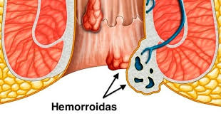

# Hemorroidas

Hemorroidas são veias ao redor do ânus ou do reto que se inflamam ou dilatam. 
Durante o movimento intestinal, essas veias dilatam-se e retraem-se, geralmente voltando ao tamanho normal. No entanto, o esforço repetido para evacuar, seja por intestino preso (obstipação) ou fezes endurecidas, pode dificultar o processo de drenagem do sangue e provocar a formação de hemorroidas. 
As hemorroidas podem ser externas ou internas. Quando externas, assemelham-se às varizes ou a pelotas de sangue e são visíveis na borda do ânus. Quando internas, localizam-se acima do esfíncter anal e causam sintomas mais agudos.
`<h1>Causas</h1>`
Obstipação, vulgarmente conhecida como prisão de ventre; 
Gravidez, em virtude da pressão que o feto exerce sobre as veias da parte inferior do abdômen; 
Obesidade, o excesso de peso também aumenta a pressão nas veias abdominais; 
Vida sedentária, diminui o estímulo para a digestão dos alimentos e a irrigação sanguínea do ânus; 
Componente genético, casos de hemorroidas na família podem indicar predisposição para desenvolver a doença. O inverso também é possível, isto é, desenvolvimento de hemorroidas sem que haja precedentes familiares; 
Dieta pobre em fibras e pequena ingestão de líquidos; 
Sexo anal, pode produzir fissuras numa região muito vascularizada.
`<h1>Sintomas</h1>`
Coceira provocada por inchaço das veias o que aumenta a tensão sobre as terminações nervosas; 
Sangramento resultante do rompimento das veias anais (sinais de sangue aguado ou manchas de sangue perceptíveis na roupa íntima ou no papel higiênico); 
Dor ou ardor durante ou após a evacuação; 
Saliência palpável no ânus.

`<h1>Tratamento</h1>`
O tratamento para as hemorroidas pode ser: 
Tópico ou local, com pomadas e supositórios; 
Cirúrgico (hemorroidectomia), isto é, retirada das veias doentes. Por vezes, apenas a punção do coágulo que entope o vaso hemorroidário pode resolver o problema sem cirurgia;< br/>
Ligadura elástica, técnica que consiste no estrangulamento da veia afetada.
`<h1>Recomendações</h1>`
Evite o papel higiênico que irrita e aumenta a inflamação. Lave a região anal e seque com toalha de algodão; 
Procure adotar uma dieta saudável à base de alimentos ricos em fibras e frutas frescas; 
Beba muito líquido, porém evite as bebidas alcoólicas; 
Respeite a necessidade de evacuar; 
Lembre-se; banheiro não é biblioteca. Permaneça sentado no vaso sanitário somente o tempo necessário para evacuar. Se não conseguir naquele momento, tente mais tarde. Procure relaxar. Muito esforço afetará as veias que podem já estar enfraquecidas; 
Evite permanecer muito tempo na mesma posição. Caminhe sempre que possível, inclusive no local de trabalho; 
Tome banhos de assento mornos. Eles podem aliviar os sintomas; 
Faça compressas de gelo; ajudam a aliviar os sintomas e a eliminar o inchaço.
`<h1>Advertência</h1>`
Hemorroidas não costumam constituir um problema muito sério de saúde. Entretanto, procure imediatamente assistência médica nos seguintes casos: 
Sangramento anal intenso acompanhado ou não de fezes; 
Sangramento que persiste por uma semana ou mais; 
Endurecimento da saliência externa que se formou no ânus.
